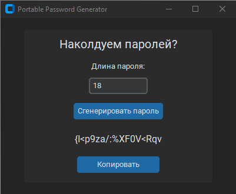

# 🔐 Portable Password Generator

[](https://github.com/Lemetti/password-generator/blob/main/LICENSE)
[](https://github.com/Lemetti/password-generator/releases/latest)
[](https://github.com/Lemetti/password-generator/actions)

**Легковесная утилита для генерации безопасных паролей с графическим интерфейсом.**

---

<p align="center">
      
</p>

## 🌟 Возможности

- Генерация паролей длиной **от 4 до 42 символов**
- Гарантированное наличие всех типов символов:
  - Строчные буквы (a-z)
  - Заглавные буквы (A-Z)  
  - Цифры (0-9)
  - Специальные символы (!@#$%^&* и др.)
- Копирование в буфер обмена одним кликом
- Portable (без установки): один .exe-файл, не требует прав администратора и не оставляет следов в системе

---

## 🚀 Начать использовать

### Вариант 1: Готовый .exe (Windows)
1. Перейдите в раздел [Releases](https://github.com/Lemetti/password-generator/releases/latest)
2. Скачайте `password-generator.exe`
3. Запустите файл (может потребоваться подтверждение безопасности)

> **Примечание:** Windows может ругаться на неизвестные .exe файлы. Это нормально для самописных программ. Нажмите "Подробнее" → "Все равно запустить".

### Вариант 2: Запуск из исходников

```bash
# Клонирование репозитория
git clone https://github.com/Lemetti/password-generator.git
cd password-generator

# Установка зависимостей
pip install -e ".[dev]"

# Запуск
python src/main.py
```

---

## 🛠️ Технические детали

- **Язык:** Python 3.9+
- **Библиотеки:** CustomTkinter, Pyperclip
- **Упаковка:** PyInstaller (один .exe файл)
- **Линтер:** Ruff
- **Тестирование:** pytest + coverage

### 🧪 Как запустить проверку стиля и тестирование

```bash
# Проверка стиля кода
ruff check .

# Запуск тестов с отчетом о покрытии
coverage run -m pytest
coverage report
```

---

## 🤝 Участие в разработке

**Приветствуются:**
- Исправления багов (через Issues и Pull Requests)
- Улучшение интерфейса
- Переводы
- Документация

См. [CONTRIBUTING.md](CONTRIBUTING.md) для подробностей.

---

## ‍💻 Разработчик

- [Alex Lemetti](https://github.com/Lemetti)

---

## ❓ FAQ

**Q: Почему Windows блокирует .exe файл?**  
**A:** Потому что файл не подписан сертификатом. Это стандартное поведение Windows. Файл безопасен. Вы можете проверить исходный код и собрать .exe самостоятельно.

**Q: Можно ли использовать на Linux/Mac?**  
**A:** Да, через запуск из исходников.

**Q: Зачем нужен этот проект?**
**A:** Это был мой эксперимент по публикации open-source репозитория "от и до".

---

## Лицензия

Проект распространяется под лицензией MIT. Подробнее: [LICENSE](LICENSE)
